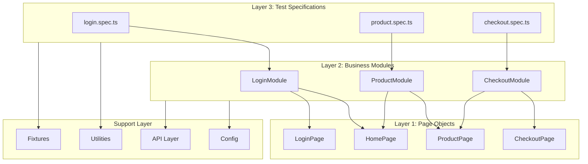
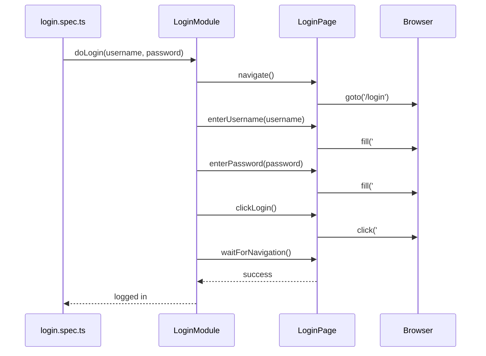
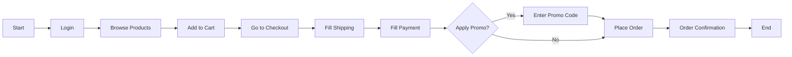

# 🎭 Playwright Test Automation Framework

A modular, scalable test automation framework built with **Playwright** and **TypeScript** using the **Page Object Model (POM)** and **Module Pattern** architecture.

> **Created by Vishal C**

## 📊 Architecture Documentation

For a comprehensive visual architecture guide, see:

- 📄 **[Architecture Diagram (HTML)](docs/ARCHITECTURE.html)** - Interactive visual documentation
- 📋 **[Quick Reference Guide](docs/QUICK_REFERENCE.md)** - Commands and best practices
- 🤖 **[AI Agents + MCP Tutor Docs](docs/ai-agents/index.mdx)** - Class pack, prompts, and guardrails
- 🧩 **[Agent Instruction Templates](.github/instructions/)** - Planner, Generator, Healer repository rules

### Architecture Overview

```
┌─────────────────────────────────────────────────────────────────────┐
│                        TEST LAYER (*.spec.ts)                       │
│         login.spec.ts │ product.spec.ts │ checkout.spec.ts          │
└──────────────────────────────┬──────────────────────────────────────┘
                               │ uses
┌──────────────────────────────▼──────────────────────────────────────┐
│                      MODULE LAYER (*Module.ts)                      │
│        LoginModule │ ProductModule │ CheckoutModule                 │
└──────────────────────────────┬──────────────────────────────────────┘
                               │ uses
┌──────────────────────────────▼──────────────────────────────────────┐
│                       PAGE LAYER (*Page.ts)                         │
│         LoginPage │ HomePage │ ProductPage │ CheckoutPage           │
└──────────────────────────────┬──────────────────────────────────────┘
                               │
          ┌────────────────────┼────────────────────┐
          ▼                    ▼                    ▼
    ┌───────────┐       ┌───────────┐       ┌───────────┐
    │ Fixtures  │       │ API Layer │       │  Utilities│
    │ (auth,    │       │ (AuthApi, │       │ (Logger,  │
    │  pages)   │       │  Products)│       │  Helpers) │
    └───────────┘       └───────────┘       └───────────┘
```

---

## 🌟 Key Features

- **Page Object Model (POM)** - Clean separation of test logic and page interactions
- **Module Pattern** - Business logic layer for complex workflows
- **API Testing Layer** - REST API testing with retry support
- **Custom Fixtures** - Pre-authenticated sessions and enhanced page handling
- **Multi-Browser Support** - Chrome, Firefox, Safari, and Mobile Chrome
- **TypeScript** - Full type safety and IntelliSense support
- **Parallel Execution** - Run tests in parallel across browsers

---

## 📁 Project Structure

```
Playwright_Framework/
├── src/
│   ├── api/                    # API testing layer
│   │   ├── AuthApi.ts          # Authentication API methods
│   │   ├── ProductApi.ts       # Product API methods
│   │   ├── OrderApi.ts         # Order API methods
│   │   └── index.ts            # API exports
│   ├── config/
│   │   └── index.ts            # Configuration & test data constants
│   ├── fixtures/
│   │   ├── auth.fixture.ts     # Pre-authenticated session fixtures
│   │   └── index.ts            # Main fixtures with page objects & modules
│   ├── modules/                # Business logic layer
│   │   ├── LoginModule.ts      # Login workflows
│   │   ├── ProductModule.ts    # Product workflows
│   │   ├── CheckoutModule.ts   # Checkout workflows
│   │   └── index.ts            # Module exports
│   ├── pages/                  # Page Object Model layer
│   │   ├── LoginPage.ts        # Login page locators & actions
│   │   ├── HomePage.ts         # Home page locators & actions
│   │   ├── ProductPage.ts      # Product page locators & actions
│   │   ├── CheckoutPage.ts     # Checkout page locators & actions
│   │   └── index.ts            # Page exports
│   ├── testdata/
│   │   ├── users.json          # User test data
│   │   ├── products.json       # Product test data
│   │   └── types.ts            # TypeScript type definitions
│   ├── tests/
│   │   ├── login.spec.ts       # Login test specifications
│   │   ├── product.spec.ts     # Product test specifications
│   │   └── checkout.spec.ts    # Checkout test specifications
│   └── utils/
│       ├── Logger.ts           # Structured logging utility
│       ├── WaitHelper.ts       # Custom wait conditions
│       ├── DataGenerator.ts    # Random test data generation
│       ├── ApiHelper.ts        # HTTP request helper with retry
│       └── index.ts            # Utility exports
├── playwright.config.ts        # Playwright configuration
├── tsconfig.json               # TypeScript configuration
├── package.json                # NPM scripts & dependencies
├── .env                        # Environment variables
└── .gitignore                  # Git ignore rules
```

---

## 🏗️ Architecture

### Three-Layer Architecture

The framework follows a **3-layer architecture** that promotes separation of concerns:

```
┌─────────────────────────────────────────────────────────────┐
│                    LAYER 3: TESTS                           │
│  (Test Specifications - login.spec.ts, product.spec.ts)     │
│  • Test scenarios and assertions                            │
│  • Uses Modules for business workflows                      │
└─────────────────────────────────────────────────────────────┘
                            │
                            ▼
┌─────────────────────────────────────────────────────────────┐
│                   LAYER 2: MODULES                          │
│  (Business Logic - LoginModule, ProductModule, etc.)        │
│  • Complex workflows and business logic                     │
│  • Orchestrates multiple Page actions                       │
└─────────────────────────────────────────────────────────────┘
                            │
                            ▼
┌─────────────────────────────────────────────────────────────┐
│                    LAYER 1: PAGES                           │
│  (Page Objects - LoginPage, ProductPage, etc.)              │
│  • Locators defined as arrow functions                      │
│  • Basic UI actions (click, fill, navigate)                 │
│  • No business logic                                        │
└─────────────────────────────────────────────────────────────┘
```

---

## 🚀 Getting Started

### Prerequisites

- Node.js 18+
- npm or yarn

### Installation

```bash
# Install dependencies
npm install

# Install Playwright browsers
npx playwright install
```

### Configuration

Update the `.env` file with your environment settings:

```env
BASE_URL=https://your-app-url.com
TEST_USERNAME=testuser
TEST_PASSWORD=testpass123
API_TIMEOUT=30000
```

---

## 📜 Available Scripts

| Command                 | Description                    |
| ----------------------- | ------------------------------ |
| `npm test`              | Run all tests in headless mode |
| `npm run test:headed`   | Run tests with browser visible |
| `npm run test:ui`       | Open Playwright UI mode        |
| `npm run test:debug`    | Debug tests with inspector     |
| `npm run test:chromium` | Run only Chromium tests        |
| `npm run test:firefox`  | Run only Firefox tests         |
| `npm run test:webkit`   | Run only WebKit tests          |
| `npm run test:mobile`   | Run mobile Chrome tests        |
| `npm run test:report`   | Show HTML test report          |
| `npm run build`         | Compile TypeScript             |
| `npm run clean`         | Clean build artifacts          |
| `npm run agents:init`   | Scaffold Playwright AI agent instruction files |
| `npm run rules:check`   | Run framework rule engine on all files |
| `npm run rules:changed` | Run framework rule engine on changed files |
| `npm run rules:staged`  | Run framework rule engine on staged files |

---

## 🧪 Test Coverage

| Test File          | Test Cases                      | Description                     |
| ------------------ | ------------------------------- | ------------------------------- |
| `login.spec.ts`    | 11                              | Login, logout, validation       |
| `product.spec.ts`  | 15                              | Product details, cart, wishlist |
| `checkout.spec.ts` | 10                              | Checkout flow, promo codes      |
| **Total**          | **36 tests × 4 browsers = 144** |                                 |

---

## 📊 Flow Diagrams

### Test Execution Flow



### Login Flow Example



### Checkout Flow



---

## 🔧 Usage Examples

### Using Page Objects

```typescript
import { LoginPage } from "../pages";

const loginPage = new LoginPage(page);
await loginPage.navigate();
await loginPage.enterUsername("user@example.com");
await loginPage.enterPassword("password123");
await loginPage.clickLogin();
```

### Using Modules

```typescript
import { LoginModule } from "../modules";

const loginModule = new LoginModule(page);
await loginModule.doLogin("user@example.com", "password123");
await loginModule.verifyLoggedIn();
```

### Using Fixtures

```typescript
import { test, expect } from "../fixtures";

test("should show dashboard after login", async ({ authenticatedPage }) => {
  // Page is already logged in via fixture
  await expect(
    authenticatedPage.locator('[data-testid="dashboard"]')
  ).toBeVisible();
});

test("with page objects", async ({ loginPage, homePage }) => {
  await loginPage.navigate();
  // Use pre-initialized page objects
});
```

### Using API Layer

```typescript
import { AuthApi, ProductApi } from "../api";

const authApi = new AuthApi();
const token = await authApi.login("user@example.com", "password");

const productApi = new ProductApi();
const products = await productApi.getProducts(token);
```

---

## 🛠️ Utilities

### Logger

```typescript
import { Logger } from "../utils";

const logger = new Logger("TestName");
logger.info("Starting test");
logger.debug("Debug information");
logger.error("Error occurred", error);
```

### WaitHelper

```typescript
import { WaitHelper } from "../utils";

const waitHelper = new WaitHelper(page);
await waitHelper.waitForCondition(async () => {
  return await page.locator(".loading").isHidden();
});
await waitHelper.retry(async () => await fetchData(), 3);
```

### DataGenerator

```typescript
import { DataGenerator } from "../utils";

const email = DataGenerator.randomEmail(); // user_abc123@test.com
const phone = DataGenerator.randomPhoneNumber(); // (555) 123-4567
const uuid = DataGenerator.uuid(); // 550e8400-e29b-41d4-a716-446655440000
```

---

## 📝 Writing New Tests

1. **Create Page Object** (if new page):

   ```typescript
   // src/pages/NewPage.ts
   export class NewPage {
     constructor(private page: Page) {}

     // Locators as arrow functions
     readonly submitButton = () => this.page.locator("#submit");

     // Actions
     async clickSubmit() {
       await this.submitButton().click();
     }
   }
   ```

2. **Create Module** (for business logic):

   ```typescript
   // src/modules/NewModule.ts
   export class NewModule {
     private newPage: NewPage;

     constructor(page: Page) {
       this.newPage = new NewPage(page);
     }

     async completeWorkflow() {
       // Orchestrate multiple page actions
     }
   }
   ```

3. **Write Test**:

   ```typescript
   // src/tests/new.spec.ts
   import { test, expect } from "../fixtures";
   import { NewModule } from "../modules";

   test("should complete workflow", async ({ page }) => {
     const module = new NewModule(page);
     await module.completeWorkflow();
     // Assertions
   });
   ```

---

## 📊 Custom Reporter

This framework includes a **Custom HTML Reporter** - a beautiful, modern HTML reporter with real-time test execution updates.

| Feature | Description |
|---------|-------------|
| 🎨 **Modern UI** | Green-themed design with Google Fonts (Inter, JetBrains Mono) |
| 📊 **Stats Dashboard** | 6 metric cards showing Total, Passed, Failed, Skipped, Pass Rate, Duration |
| 📋 **Console Logs per Step** | Each `console.log()` in `test.step()` is captured and displayed |
| 🎬 **Screenshots & Videos** | Auto-captured on failure with inline previews |
| 📍 **Trace Viewer** | Direct links to Playwright trace files |
| 🔍 **Filters** | Filter by Priority (P0, P1, P2) and Status (Passed/Failed/Skipped) |
| ⏱️ **Real-time Updates** | Live console output during test execution |

### Usage

The reporter is automatically configured in `playwright.config.ts`:

```typescript
reporter: [
    ['./src/utils/CustomTTAReporter.ts'],
    ['html', { open: 'never' }],
    ['json', { outputFile: 'test-results/results.json' }],
    ['list'],
],
```

### Console Log Capture

Capture console logs in your test steps:

```typescript
test('example test', async ({ page }) => {
    await test.step('Verify page title', async () => {
        const title = await page.title();
        console.log(`Page Title: ${title}`);  // ← Appears in step's console output
        expect(title).toBeTruthy();
    });
});
```

Reports are generated in `tta-report/` directory with timestamped filenames.

---

## 📈 Reports

After running tests, view the HTML report:

```bash
npm run test:report
```

Reports are generated in:

- `tta-report/` - Custom HTML reports (recommended)
- `playwright-report/` - Default Playwright HTML report
- `test-results/` - JSON results and screenshots

---

## 🐳 Docker Support

Run tests in containerized environments with parallel sharding:

### Using Dockerfile

```bash
# Build the image
docker build -t playwright-framework .

# Run all tests
docker run --rm playwright-framework

# Run smoke tests
docker run --rm playwright-framework npx playwright test --grep @Smoke

# Run with sharding (shard 1 of 4)
docker run --rm playwright-framework npx playwright test --shard=1/4

# Mount results directory
docker run --rm -v $(pwd)/results:/app/test-results playwright-framework
```

### Using Docker Compose (Parallel Shards)

```bash
# Run all 4 shards in parallel
docker-compose up

# Run only smoke tests
docker-compose up smoke

# Run single shard
docker-compose up shard-1

# Stop and clean up
docker-compose down
```

---

## 🔄 CI/CD Integration

### GitHub Actions

The framework includes pre-configured GitHub Actions workflows:

| Workflow | Trigger | Description |
|----------|---------|-------------|
| `playwright.yml` | Push/PR to main, develop | Full test suite with 4 parallel shards |
| `smoke-tests.yml` | Pull requests | Quick smoke tests (@P0, @Smoke) |

**Features:**
- ✅ Parallel test execution with sharding
- ✅ Automatic artifact upload (reports, screenshots)
- ✅ GitHub Summary with test results
- ✅ Manual trigger with custom test tags

### Jenkins Pipeline

```bash
# The Jenkinsfile supports:
- Parameterized builds (test type, browser, shard count)
- Docker-based execution
- HTML report publishing
- Slack notifications (optional)
```

---

## 🔧 Code Quality Tools

### ESLint + Prettier

```bash
# Run linting
npm run lint

# Fix linting issues
npm run lint:fix

# Format code
npm run format

# Check formatting
npm run format:check
```

### Configuration Files

| File | Purpose |
|------|---------|
| `.eslintrc.json` | ESLint rules (TypeScript + Playwright) |
| `.prettierrc` | Code formatting rules |
| `.editorconfig` | Editor settings consistency |

### Husky + Commitlint

Pre-commit hooks ensure code quality:

```bash
# Pre-commit hook runs:
- ESLint on staged files
- TypeScript type checking
- Framework rule engine on staged files

# Commit message validation:
# Format: type(scope): description
# Example: feat(login): add remember me functionality
```

**Valid commit types:**
`feat`, `fix`, `docs`, `style`, `refactor`, `perf`, `test`, `build`, `ci`, `chore`, `revert`

---

## 🤖 AI Assistant Support

This framework is optimized for AI-assisted development:

| Tool | Configuration File | Description |
|------|-------------------|-------------|
| **Augment Code** | `.augment/rules/` | Framework rules + code standards |
| **GitHub Copilot** | `.github/copilot-instructions.md` | Copilot-specific instructions |
| **Cursor AI** | `.cursorrules` | Cursor editor rules |
| **Windsurf AI** | `.windsurfrules` | Windsurf editor rules |

AI assistants are trained to:
- Follow 3-layer architecture (Pages → Modules → Tests)
- Use arrow functions for locators
- Include test.step() for reporting
- Apply proper test tags (@P0, @Smoke, etc.)

---

## 🤝 Contributing

1. Follow the existing architecture patterns
2. Keep Page Objects focused on locators and basic actions
3. Put business logic in Modules
4. Write descriptive test names
5. Use TypeScript types consistently
6. Use conventional commit messages

---

## 📚 Project Files Structure

```
Playwright_Framework/
├── .github/
│   ├── workflows/
│   │   ├── playwright.yml         # Main CI workflow
│   │   └── smoke-tests.yml        # PR smoke tests
│   └── copilot-instructions.md    # GitHub Copilot rules
├── .augment/rules/
│   ├── framework-rules.md         # Page Object & Module patterns
│   └── code-standards.md          # Coding standards
├── .husky/
│   ├── pre-commit                 # Pre-commit hooks
│   └── commit-msg                 # Commit message validation
├── docs/
│   ├── images/
│   │   ├── arch.png               # Architecture diagram
│   │   └── report.png             # Reporter screenshot
│   ├── ARCHITECTURE.html          # Visual architecture
│   ├── QUICK_REFERENCE.md         # Commands & best practices
│   └── ai-agents/                 # AI agents + MCP tutorial docs
├── rules/
│   └── framework-rule-engine.json # Architecture and placement rules
├── scripts/
│   └── rule-engine.js             # Rule engine validator script
├── skills/
│   └── playwright-ai-mcp-tutor/   # Reusable tutor skill pack
├── Dockerfile                     # Docker image config
├── docker-compose.yml             # Docker Compose with sharding
├── Jenkinsfile                    # Jenkins pipeline
├── .eslintrc.json                 # ESLint configuration
├── .prettierrc                    # Prettier configuration
├── .editorconfig                  # Editor configuration
├── .cursorrules                   # Cursor AI rules
├── .windsurfrules                 # Windsurf AI rules
├── commitlint.config.js           # Commit message rules
└── playwright.config.ts           # Playwright configuration
```

---

## 🧭 Why We Added Rule Engine and AI/MCP Controls

These additions were made to keep AI-assisted automation deterministic, reviewable, and framework-compliant.

- **Rule Engine (`rules/framework-rule-engine.json` + `scripts/rule-engine.js`)**
  - Enforces file placement (`Page` -> `src/pages`, `Module/Modal` -> `src/modules`, `spec` -> `src/tests`, utilities -> `src/utils`)
  - Enforces architecture patterns (no direct locator usage in modules, tags and `test.step()` in specs)
  - Reduces random code generation and framework drift before code reaches PR review

- **AI Agent Instructions (`.github/instructions/`)**
  - Defines clear responsibilities for `Planner`, `Generator`, and `Healer`
  - Keeps generation constrained to repository standards and naming rules
  - Encourages minimal, evidence-based healing instead of broad rewrites

- **MCP + Tutor Docs (`docs/ai-agents/` and `mint.json`)**
  - Provides a simple training path for teaching AI-assisted Playwright workflows
  - Shows prompt templates and validation gates to reduce hallucination risk
  - Helps new contributors follow the same process from planning to healing

- **Skill Pack (`skills/playwright-ai-mcp-tutor/`)**
  - Reusable instruction bundle for repeating the same teaching workflow
  - Standardizes prompts, guardrails, and expected outputs across batches

---

## 📄 License

ISC

---

## 👨‍💻 Author

**Vishal C**

---

<p align="center">
  Playwright Test Automation Framework
</p>